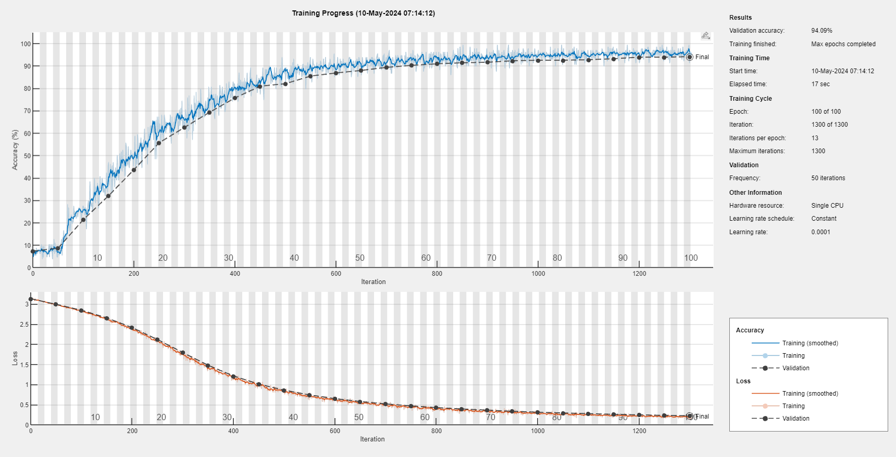
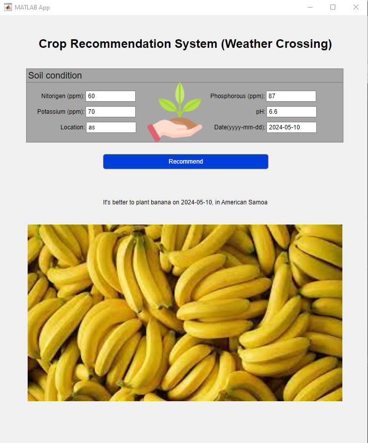

# Crop Recommendation Web App with AI and VisaulCrossing API: An application for Crop Recommendation using MATLAB

## Table of Contents
* [Introduction](#introduction)
* [Running App](#running-app)
* [Documentation](#documentation)
* [Contact](#contact)
* [License](#license)

## Introduction
The agriculture industry is one of the most significant contributors to the global economy, providing food, bjos, and income for millions of people all over the world. However, the amount of the production is very limited and disrupted due to serious climate change.

Crop planting recommendation using AI is a technological solution that can increase the productivity. We can analyze the effect of the weather data on the agriculture, and it is apparent that the weather is the key factor in the crops. With this data, the solution can make personalized recommendations to farmers on the crops that are best suited for their specific conditions, such as soil type, climate, and topography.

The app recommend the suitable crop in the specific area based on the weather data fetched from [Weather Data API](https://www.visualcrossing.com/weather-api). In this app, we trained the machine learning model based on the data including soil conditions and weather data, and predict the suitable crop in the specific area using this model. This app will assist farmers in increasing agricultural productivity, preventing soil degradation in cultivated land, reducing chemical use in crop production, and maximizing water resource efficiency.

## Running App
### Train the model
You can train the model by running `train_network.m` file in `app` folder.

The training result is as follows:

```
Accuracy of the network on the train data: 95.74%
```

### Predict the crop
You can recommend the crop by running `main.mlapp` in the `app` folder using the trained model.

## Documentation
* After running the app, you can input the required soil conditions, location and the date to predict, and predict the recommendation of the crop by clicking the [recommend] button.


## Contact
I hope to work with you. If you have any projects, you can contact me via Skype ID [live:.cid.b8144cf89d38b550]. I can help you in many areas including software development, web development and simulation. Thanks for your attention.

## License
[GNU GPL](LICENSE.txt)
